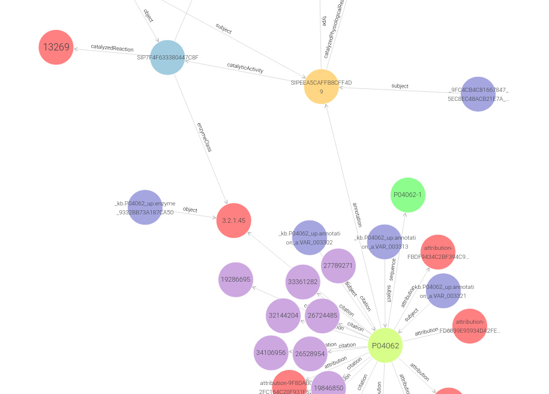

# GBA1 'Lysosomal acid glucosylceramidase'

## Learning outcomes

**After having completed this chapter, you will be able to:**

- Understand the structure of a simple '`biological`' database encoded in Turtle
- Write simple SELECT SPARQL queries


## Material

The exercises below follow the same structure as the [music example](/music/), with a focus on the GBA1 gene involved in the Gaucher disease.


## GBA1 graph exploration

Take some time to explore the `GBA1` protein graph.

It has a lot of classes connecting the different knowledges curated and aggregated by the UniProt team.

[](/assets/images/GraphDB-class-hierarchy.png)

[](/assets/images/GraphDB-class-relationships.png)


## GBA1 graph SPARQL queries

We will do some exercises on the GBA1 graph, with a focus on the reactions catalyzed by the enzyme GBA1.


### DESCRIBE

You have seen during the graph exploration that some concepts can be cryptic, their name is not always meaningful.

The `DESCRIBE` command is for you! As its name suggests, `DESCRIBE` provides a useful fragment of RDF, such as all the known details for each URI found.

```sparql title="Describe_up:catalyzedReaction.sparql"
# Describe the up:catalyzedReaction concept

PREFIX up: <http://purl.uniprot.org/core/>
DESCRIBE up:catalyzedReaction
```

**Exercise:**

+ Where is the `up:catalyzedReaction` concept found in the graph?
+ In which predicates is it involved?

??? done "Answer"
	```
	     subject                 predicate             object
	1    up:catalyzedReaction    rdf:type              rdf:Property
	2    up:catalyzedReaction    rdfs:subPropertyOf    up:catalyzedReaction
	3    up:catalyzedReaction    rdfs:subPropertyOf    up:catalyzedReaction
	```


<br>
### SELECT
**What is the GBA1 protein name?**

The *predicate* qualifying the protein name is `up:fullName`.

**Exercise:** Use this predicate to find the GBA1 protein (full) name.

A `SELECT` manual can be found [here](https://en.wikibooks.org/wiki/SPARQL/SELECT).

??? done "Answer"
	```sparql title="Protein_name.sparql"
	# Retrieve the protein name associated with the P04062 UniProt entry
	
	PREFIX up: <http://purl.uniprot.org/core/>
	SELECT ?protein_name WHERE {
		?s up:fullName ?protein_name .
	}
	```
	```
	####################################################################
	
	      protein_name
	1    "Lysosomal acid glucosylceramidase"
	```

There are in fact several names, with time this protein has accumulated a lot of aliases.


<br>
### SELECT and ORDER
**Which reactions are catalyzed by this enzyme?**

**Exercise:** Using the `up:catalyzedReaction` predicate, get the reactions catalyzed by GBA1.

??? done "Answer"
	```sparql title="This_enz_catalyses.sparql"
	# Which reactions are catalyzed by this enzyme?
	
	PREFIX up: <http://purl.uniprot.org/core/>
	SELECT ?reactions WHERE {
		?s up:catalyzedReaction ?reactions .
	}
    ```
    ```
	##########################################
	
	      reactions
	1     http://rdf.rhea-db.org/13269
	2     http://rdf.rhea-db.org/14297
	3     http://rdf.rhea-db.org/11956
	4     http://rdf.rhea-db.org/58264
	5     http://rdf.rhea-db.org/58324
	6     http://rdf.rhea-db.org/58316
	7     http://rdf.rhea-db.org/70303
	8     http://rdf.rhea-db.org/70307
	9     http://rdf.rhea-db.org/70311
	10    http://rdf.rhea-db.org/70315
	11    http://rdf.rhea-db.org/70235
	12    http://rdf.rhea-db.org/70255
	13    http://rdf.rhea-db.org/70239
	14    http://rdf.rhea-db.org/70251
    ```


All GBA1 catalyzed reactions are reactions in [Rhea](https://www.rhea-db.org/).

**Exercise:** Order this list by descending Rhea ids

??? done "Answer"
	```sparql
	# Which reactions are catalyzed by this enzyme?
	
	PREFIX up: <http://purl.uniprot.org/core/>
	SELECT ?reactions WHERE {
		?s up:catalyzedReaction ?reactions .
	}
	ORDER BY DESC(?reactions)
    ```
    ```
	##########################################
	
	      reactions
	1     http://rdf.rhea-db.org/70315
	2     http://rdf.rhea-db.org/70311
	3     http://rdf.rhea-db.org/70307
	4     http://rdf.rhea-db.org/70303
	5     http://rdf.rhea-db.org/70255
	6     http://rdf.rhea-db.org/70251
	7     http://rdf.rhea-db.org/70239
	8     http://rdf.rhea-db.org/70235
	9     http://rdf.rhea-db.org/58324
	10    http://rdf.rhea-db.org/58316
	11    http://rdf.rhea-db.org/58264
	12    http://rdf.rhea-db.org/14297
	13    http://rdf.rhea-db.org/13269
	14    http://rdf.rhea-db.org/11956
    ```


<br>
### SELECT (with multiple triples)
**What are the reactions associated with an EC number?**

The GBA1 graph contains also an enzyme class (`up:enzymeClass` predicate).

**Exercise:** Get the GBA1 Rhea reactions associated with an EC number

??? done "Answer"
    ```sparql
	# What are Rhea reactions associated with an EC number?
	
	PREFIX up: <http://purl.uniprot.org/core/>
	SELECT ?rhea ?EC WHERE {
		?CatalyticActivity  up:catalyzedReaction   ?rhea .
		?CatalyticActivity  up:enzymeClass         ?EC .
	}
	```
    ```
    ##########################################
	
	     rhea                            EC
	1    http://rdf.rhea-db.org/13269    enzyme:3.2.1.45
	2    http://rdf.rhea-db.org/14297    enzyme:3.2.1.46
	```


The two triples use the same subject named `?CatalyticActivity` in this example.

The query can be simplified with the **;** punctuation sign.

**Exercise:** Simplify the previous query with **;**

??? done "Answer"
    ```sparql title=""
	# What are Rhea reactions associated with an EC number?
	
	PREFIX up: <http://purl.uniprot.org/core/>
	SELECT ?rhea ?EC WHERE {
		?CatalyticActivity  up:catalyzedReaction   ?rhea ;
		                    up:enzymeClass         ?EC .
	}
    ```
    ```
	##########################################
	
	     rhea                            EC
	1    http://rdf.rhea-db.org/13269    enzyme:3.2.1.45
	2    http://rdf.rhea-db.org/14297    enzyme:3.2.1.46
    ```


<br>
### SELECT and OPTIONAL
**What are the reactions associated with an EC number, and those which are not?**

We have seen previously that GBA1 catalyzes 14 reactions. All of them are linked to Rhea, but not all of them are linked to an EC number.

**Exercise:** Get all the GBA1 Rhea reactions associated with an EC number or not

A `OPTIONAL` manual can be found [here](https://en.wikibooks.org/wiki/SPARQL/OPTIONAL).

??? done "Answer"
    ```sparql
	# What are reactions associated or not with an EC number?
	
	PREFIX up: <http://purl.uniprot.org/core/>
	SELECT ?reaction ?EC  WHERE {
			?CatalyticActivity  up:catalyzedReaction  ?reaction .
		OPTIONAL {
			?CatalyticActivity  up:enzymeClass        ?EC .
		}
	}
	
	```
	```
	##########################################
	
	     reaction                        EC
	1    http://rdf.rhea-db.org/13269    enzyme:3.2.1.45
	2    http://rdf.rhea-db.org/14297    enzyme:3.2.1.46
	3    http://rdf.rhea-db.org/11956    
	4    http://rdf.rhea-db.org/58264    
	5    http://rdf.rhea-db.org/58324    
	6    http://rdf.rhea-db.org/58316    
	7    http://rdf.rhea-db.org/70303    
	8    http://rdf.rhea-db.org/70307    
	9    http://rdf.rhea-db.org/70311    
	10   http://rdf.rhea-db.org/70315    
	11   http://rdf.rhea-db.org/70235    
	12   http://rdf.rhea-db.org/70255    
	13   http://rdf.rhea-db.org/70239    
	14   http://rdf.rhea-db.org/70251    
	```


<br>
### SELECT and FILTER

The results of the previous query are URI. You can see that by clicking on the *Raw response* button in the GraphDB result section.

To filter on them, and apply comparison operators you have seen in the music example, you have to turn them (cast them) in a category easier to work on.

You can stringify a URI/IRI with the `STR` function (A `STR` manual can be found [here](https://en.wikibooks.org/wiki/SPARQL/Expressions_and_Functions#STR)).

E.g. `STR(?reaction)`

**Exercise:** From the previous SPARQL query, filter them to get only reactions upper than "http://rdf.rhea-db.org/13269"

??? done "Answer"
    ```sparql
	# What are reactions associated or not with an EC number, only with reactions upper than "http://rdf.rhea-db.org/13269"?
	
	PREFIX up: <http://purl.uniprot.org/core/>
	SELECT ?reaction ?EC  WHERE {
			?CatalyticActivity  up:catalyzedReaction  ?reaction .
		OPTIONAL {
			?CatalyticActivity  up:enzymeClass        ?EC .
		}
		FILTER( STR(?reaction) > "http://rdf.rhea-db.org/13269" )
	}
	```
	```
	##########################################
	
	     reaction                        EC
	1    http://rdf.rhea-db.org/14297    enzyme:3.2.1.46
	2    http://rdf.rhea-db.org/58264
	3    http://rdf.rhea-db.org/58324
	4    http://rdf.rhea-db.org/58316
	5    http://rdf.rhea-db.org/70303
	6    http://rdf.rhea-db.org/70307
	7    http://rdf.rhea-db.org/70311
	8    http://rdf.rhea-db.org/70315
	9    http://rdf.rhea-db.org/70235
	10   http://rdf.rhea-db.org/70255
	11   http://rdf.rhea-db.org/70239
	12   http://rdf.rhea-db.org/70251
	```

The `FILTER` function is very powerful. It can be combined with the `REGEX()` function to do almost everything you can think of ([REGEX manual](https://en.wikibooks.org/wiki/SPARQL/Expressions_and_Functions#REGEX)).


<br>
### SELECT and BIND

The `STR()` cast can be assigned in a new variable.

**Exercise:** Use the `BIND` function to do it

A `BIND` manual can be found [here](https://en.wikibooks.org/wiki/SPARQL/Expressions_and_Functions#BIND).

??? done "Answer"
    ```sparql
	# What are reactions associated or not with an EC number, only with reactions upper than "http://rdf.rhea-db.org/13269"?
	
	PREFIX up: <http://purl.uniprot.org/core/>
	SELECT ?reaction ?EC  WHERE {
			?CatalyticActivity  up:catalyzedReaction  ?reaction .
		OPTIONAL {
			?CatalyticActivity  up:enzymeClass        ?EC .
		}
		BIND ( STR(?reaction) AS ?reac_string )
		FILTER( ?reac_string > "http://rdf.rhea-db.org/13269" )
	}
    ```

EC numbers are easily identifiable. We don't really need the *enzyme:* prefix.

The `REPLACE` function is here for that ([REPLACE manual](https://en.wikibooks.org/wiki/SPARQL/Expressions_and_Functions#REPLACE)). It replaces all occurences of a *pattern* by another *pattern*.

**Exercise:** Remove the *enzyme:* prefix, i.e. replace it by nothing, in a `BIND` function.

Think to stringify `?EC` first.

??? done "Answer"
    ```sparql
	# What are reactions associated or not with an EC number, only with reactions upper than "http://rdf.rhea-db.org/13269"?
	
	PREFIX up: <http://purl.uniprot.org/core/>
	SELECT ?reaction ?ec  WHERE {
			?CatalyticActivity  up:catalyzedReaction  ?reaction .
		OPTIONAL {
			?CatalyticActivity  up:enzymeClass        ?EC .
		}
		BIND ( STR(?reaction) AS ?reac_string )
		BIND ( REPLACE( STR(?EC), "enzyme:", "" ) AS ?ec )
		FILTER( ?reac_string > "http://rdf.rhea-db.org/13269" )
	}
	```
	```
	##########################################
	
	     reaction                        EC
	1    http://rdf.rhea-db.org/14297    "http://purl.uniprot.org/enzyme/3.2.1.46"
	```

The stringification transforms `?EC` in its prefixed literal form `"http://purl.uniprot.org/enzyme/3.2.1.46"`.

The right `REPLACE` pattern to apply is

??? done "Answer"
    ```sparql
	BIND ( REPLACE( STR(?EC), "http://purl.uniprot.org/enzyme/", "" ) AS ?ec )
	# for regex lovers
	BIND ( REPLACE( STR(?EC), "^.*enzyme/", "" ) AS ?ec )
	```
    ```
	##########################################
	
	     reaction                        EC
	1    http://rdf.rhea-db.org/14297    "3.2.1.46"
	```


<br>
### SELECT and aggregation

Go back to the *SELECT and OPTIONAL* query.

**Exercise:**  We want now to `COUNT` how many reactions are found by this SPARQL query.

A `COUNT` manual can be found [here](https://en.wikibooks.org/wiki/SPARQL/Expressions_and_Functions#COUNT,_MIN,_MAX,_AVG_and_SUM) or [here](https://en.wikibooks.org/wiki/SPARQL/Aggregate_functions).

??? done "Answer"
    ```sparql
	# How many reactions associated or not with an EC number?
	
	PREFIX up: <http://purl.uniprot.org/core/>
	SELECT (COUNT(?reaction) AS ?count) WHERE {
			?CatalyticActivity  up:catalyzedReaction  ?reaction .
		OPTIONAL {
			?CatalyticActivity  up:enzymeClass        ?EC .
		}
	}
    ```
    ```
	##########################################
	
	     count
	1    "14"^^xsd:integer
	```

You can notice that the returned result has the right type for a number i.e. `xsd:integer`.


<br>
### SELECT and GROUP BY

**Exercise:**  We want now to `COUNT` per EC number, i.e to know how many time each EC number is found.

A `GROUP BY` manual can be found [here](https://en.wikibooks.org/wiki/SPARQL/Modifiers#GROUP_BY).

??? done "Answer"
    ```sparql
	# How many reactions associated with each EC number?
	 
	PREFIX up: <http://purl.uniprot.org/core/>
	SELECT ?EC (COUNT(?reaction) AS ?count) WHERE {
			?CatalyticActivity  up:catalyzedReaction  ?reaction .
		OPTIONAL {
			?CatalyticActivity  up:enzymeClass        ?EC .
		}
	}
	GROUP BY ?EC
    ```
    ```
	##########################################
	
	     EC                 count
	1    enzyme:3.2.1.45    "1"^^xsd:integer
	2    enzyme:3.2.1.46    "1"^^xsd:integer
	3                       "12"^^xsd:integer
    ```


<br>
### SELECT and subqueries

"SPARQL allows one SELECT query to be nested inside another. The inner SELECT query is called a `subquery` and is evaluated first. The subquery result variable(s) can then be used in the outer SELECT query."

**Exercise:**  ???

A *subquery* manual can be found [here](https://en.wikibooks.org/wiki/SPARQL/Subqueries).


<br>
### Property paths

Property paths are the way two items are connected. The simplest path is just a single property, which forms an ordinary triple:

```sparql
?item  path  ?property
?item  --->  ?property
```

If items are not directly connected, their paths are longer. You can add path elements with a forward slash (`/`).

`?item path1/path2/path3 ?property`

This is equivalent to either of the following:

```sparql
?item   path1  ?temp1 .
?temp1  path2  ?temp2 .
?temp2  path3  ?property .
```

or

```sparql
?item path1 [ path2 [ path3 ?property ] ] .
```

A *property paths* manual can be found [here](https://en.wikibooks.org/wiki/SPARQL/Property_paths).

[](/assets/images/property_path.png)

```sparql
?protein                        up:annotation         ?catalytic_activity_annotation .
?catalytic_activity_annotation  up:catalyticActivity  ?activity .
?activity                       up:catalyzedReaction  ?rhea .
```

**Exercise:** Using *property paths*, simplify the query above:

??? done "Answer"
    ```sparql
	# Use property paths to simplify the previous query
	
	PREFIX up: <http://purl.uniprot.org/core/>
	SELECT ?protein ?rhea WHERE {
		?protein up:annotation/up:catalyticActivity/up:catalyzedReaction ?rhea .
	}
    ```
    ```
	##########################################
	
	      protein                                   rhea
	1     http://purl.uniprot.org/uniprot/P04062    http://rdf.rhea-db.org/13269
	2     http://purl.uniprot.org/uniprot/P04062    http://rdf.rhea-db.org/14297
	3     http://purl.uniprot.org/uniprot/P04062    http://rdf.rhea-db.org/11956
	4     http://purl.uniprot.org/uniprot/P04062    http://rdf.rhea-db.org/58264
	5     http://purl.uniprot.org/uniprot/P04062    http://rdf.rhea-db.org/58324
	6     http://purl.uniprot.org/uniprot/P04062    http://rdf.rhea-db.org/58316
	7     http://purl.uniprot.org/uniprot/P04062    http://rdf.rhea-db.org/70303
	8     http://purl.uniprot.org/uniprot/P04062    http://rdf.rhea-db.org/70307
	9     http://purl.uniprot.org/uniprot/P04062    http://rdf.rhea-db.org/70311
	10    http://purl.uniprot.org/uniprot/P04062    http://rdf.rhea-db.org/70315
	11    http://purl.uniprot.org/uniprot/P04062    http://rdf.rhea-db.org/70235
	12    http://purl.uniprot.org/uniprot/P04062    http://rdf.rhea-db.org/70255
	13    http://purl.uniprot.org/uniprot/P04062    http://rdf.rhea-db.org/70239
	14    http://purl.uniprot.org/uniprot/P04062    http://rdf.rhea-db.org/70251
    ```

Note we follow the directions shown as arrows on the graph picture, from the light green `P04062`, to the dark yellow `SIPEEA5CAFFB8CFF4D9`, to the light blue `SIP7F4F633380447C8F`, then to the red `13269`.

#### Inverse path

To go in the other direction, i.e. in the opposite direction the arrows go, we have to use *inverse path*.


