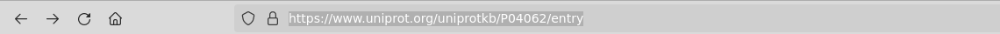
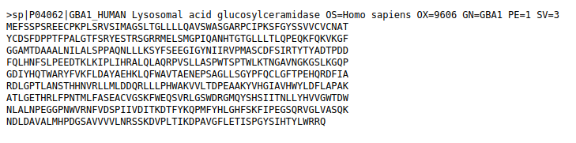

# GBA1 'Lysosomal acid glucosylceramidase'

## Learning outcomes

**After having completed this chapter, you will be able to:**

- Understand the structure of a simple '`biological`' database encoded in turtle
- Write simple SELECT SPARQL queries


## Material

The exercises below follow the same structure as the [music exercises](/music/), with a focus on the GBA1 gene involved in the Gaucher disease.

Let's look at the [GBA1](https://www.uniprot.org/uniprotkb/P04062) entry in [UniProt](https://www.uniprot.org/):

[](/assets/images/GBA1_in_UniProt.png)

Some variants of this protein caused the [Gaucher disease](https://en.wikipedia.org/wiki/Gaucher%27s_disease).

[](/assets/images/Gaucher_disease.png)


## Export a ttl (Turtle) file from UniProt

A Turtle file can be exported directly from a UniProt entry page.

[](/assets/images/P04062_url.png)

[](/assets/images/P04062.fasta.png)

[](/assets/images/P04062.fasta2.png)

[](/assets/images/P04062.ttl.png)


## Import a ttl file in GraphDB

### Create a new repository

Go to the GraphDB main screen

[](assets/images/GraphDB_main-screen.png)

Create a new repository to work in

[](assets/images/GraphDB_repository-setup.png)

[](assets/images/GraphDB_new-repository.png)

[](assets/images/GraphDB_choose-GraphDB-repository.png)

[](assets/images/GraphDB_choose-repository-ID.png)

[](assets/images/GraphDB_activate-new-repository.png)

[](assets/images/GraphDB_new-repository-activated.png)

[](assets/images/GraphDB_new-repository-running.png)


### Import a ttl file

A Turtle file can be easily imported in GraphDB

[](assets/images/GraphDB_want-to-import.png)

Select **Upload RDF files**, and upload your Turtle file(s)

[](assets/images/GraphDB_Select-RDF-to-import.png)

[](assets/images/GraphDB_ready-to-import.png)

[](assets/images/GraphDB_imported-successfully.png)

The GraphDB main page shows statistics about the data in your repository

[](assets/images/GraphDB_repository-statistics.png)


## SPARQL queries in GraphDB

### DESCRIBE a concept

As its name suggests, `DESCRIBE` provides a useful fragment of RDF, such as all the known details for each URI found.

```sparql title="Describe_up:catalyzedReaction.sparql"
# Describe the up:catalyzedReaction concept

PREFIX up: <http://purl.uniprot.org/core/>
DESCRIBE up:catalyzedReaction
```

**Exercise:**

+ Where is the `up:catalyzedReaction` concept found in the graph?
+ In which predicates is it involved?

??? done "Answer"
	```
	     subject                 predicate             object
	1    up:catalyzedReaction    rdf:type              rdf:Property
	2    up:catalyzedReaction    rdfs:subPropertyOf    up:catalyzedReaction
	3    up:catalyzedReaction    rdfs:subPropertyOf    up:catalyzedReaction
	```


### What is the GBA1 protein name?

The *predicate* qualifying the protein name is `up:fullName`.

**Exercise:** Use this predicate to find the GBA1 protein (full) name.

??? done "Answer"
	```sparql title="Protein_name.sparql"
	# Retrieve the protein name associated with the P04062 UniProt entry
	
	PREFIX up: <http://purl.uniprot.org/core/>
	SELECT ?protein_name WHERE {
		?s up:fullName ?protein_name .
	}
	```
	```
	####################################################################
	
	      protein_name
	1    "Lysosomal acid glucosylceramidase"
	```


### What does this enzyme catalyze?

**Exercise:** Using the `up:catalyzedReaction` predicate, get the reactions catalyzed by this enzyme.

??? done "Answer"
	```sparql title="This_enz_catalyses.sparql"
	# What does this enzyme catalyse?
	
	PREFIX up: <http://purl.uniprot.org/core/>
	SELECT ?reactions WHERE {
		?s up:catalyzedReaction ?reactions .
	}
    ```
    ```
	##########################################
	
	      reactions
	1     http://rdf.rhea-db.org/13269
	2     http://rdf.rhea-db.org/14297
	3     http://rdf.rhea-db.org/11956
	4     http://rdf.rhea-db.org/58264
	5     http://rdf.rhea-db.org/58324
	6     http://rdf.rhea-db.org/58316
	7     http://rdf.rhea-db.org/70303
	8     http://rdf.rhea-db.org/70307
	9     http://rdf.rhea-db.org/70311
	10    http://rdf.rhea-db.org/70315
	11    http://rdf.rhea-db.org/70235
	12    http://rdf.rhea-db.org/70255
	13    http://rdf.rhea-db.org/70239
	14    http://rdf.rhea-db.org/70251
    ```


**Exercise:** Order this list by descending Rhea ids

??? done "Answer"
	```sparql
	# What does this enzyme catalyse?
	
	PREFIX up: <http://purl.uniprot.org/core/>
	SELECT ?reactions WHERE {
		?s up:catalyzedReaction ?reactions .
	}
	ORDER BY DESC(?reactions)
    ```
    ```
	##########################################
	
	      reactions
	1     http://rdf.rhea-db.org/70315
	2     http://rdf.rhea-db.org/70311
	3     http://rdf.rhea-db.org/70307
	4     http://rdf.rhea-db.org/70303
	5     http://rdf.rhea-db.org/70255
	6     http://rdf.rhea-db.org/70251
	7     http://rdf.rhea-db.org/70239
	8     http://rdf.rhea-db.org/70235
	9     http://rdf.rhea-db.org/58324
	10    http://rdf.rhea-db.org/58316
	11    http://rdf.rhea-db.org/58264
	12    http://rdf.rhea-db.org/14297
	13    http://rdf.rhea-db.org/13269
	14    http://rdf.rhea-db.org/11956
    ```


### TODO

