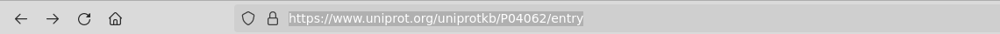
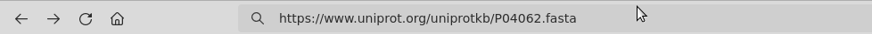
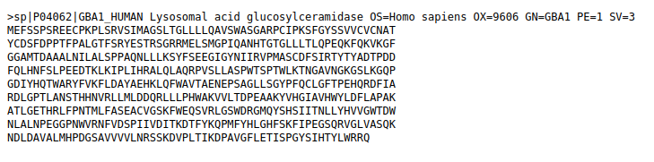
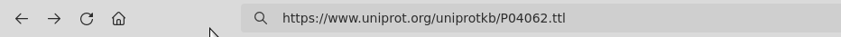

# GBA1 'Lysosomal acid glucosylceramidase' Turtle

## Learning outcomes

**After having completed this chapter, you will be able to:**

- Get a *Turtle* file from a UniProt entry
- Import a *Turtle* file in GraphDB

## Material

The exercises below follow the same structure as the [music example](/music/), with a focus on the GBA1 gene involved in the Gaucher disease.

Let's look at the [GBA1](https://www.uniprot.org/uniprotkb/P04062) entry in [UniProt](https://www.uniprot.org/):

Some variants of this protein caused the [Gaucher disease](https://en.wikipedia.org/wiki/Gaucher%27s_disease).

## Export a ttl (Turtle) file from UniProt

A Turtle file can be exported directly from a UniProt entry page.

## Import a ttl file in GraphDB

### Create a new repository

Go to the GraphDB main screen

Create a new repository to work in

### Import a ttl file

A Turtle file can be easily imported in GraphDB

Select **Upload RDF files**, and upload your Turtle file(s)

The GraphDB main page shows statistics about the data in your repository

[Next](/gba1/) Queries on the GBA1 graph

