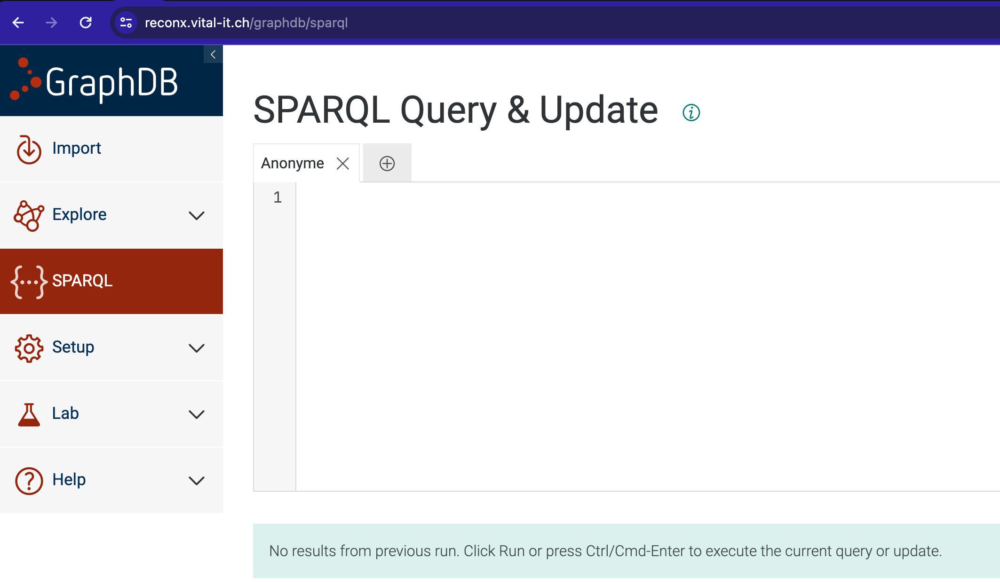

# Basic SPARQL tutorial on a music example

## Learning outcomes

**After having completed this chapter, you will be able to:**

- Understand the structure of a simple database encoded in turtle
- Write simple SELECT SPARQL queries

First, a toy example showing examples of queries and solutions
[:fontawesome-solid-file-pdf: Download the presentation](/SPARQL_course/assets/pdf/Recon4IMD_graph_queries.pdf){: .md-button }

This is a do-it-yourself tutorial! We are here for questions and can discuss some of the exercices together!

## Material

The exercises below are based on [this tutorial](https://docs.stardog.com/getting-started-series/getting-started-4) and [data](https://github.com/stardog-union/stardog-tutorials/tree/master/music) from [Stardog](https://docs.stardog.com/).

We will still use the "music" database that we explored in graphdb, below is a short extract with the Beatles as a reminder :

```ttl title="beatles_simplified.ttl"
PREFIX : <http://contextualise.dev/ontology/>
PREFIX rdf: <http://www.w3.org/1999/02/22-rdf-syntax-ns#>
PREFIX xsd: <http://www.w3.org/2001/XMLSchema#>

:The_Beatles      a :Band ;
                  :name "The Beatles" ;
                  :member :John_Lennon , :Paul_McCartney , :George_Harrison, :Ringo_Starr .
:John_Lennon      a :SoloArtist .
:Paul_McCartney   a :SoloArtist .
:Ringo_Starr      a :SoloArtist .
:George_Harrison  a :SoloArtist .
:Please_Please_Me a :Album ;
                  :name "Please Please Me" ;
                  :date "1963-03-22"^^xsd:date ;
                  :artist :The_Beatles ;
                  :track :Love_Me_Do .
:Love_Me_Do       a :Song ;
                  :name "Love Me Do" ;
                  :length 125 ;
                  :writer :John_Lennon , :Paul_McCartney .
```

What is different from the previous example?

Let's use this music database to write (not too complicated) SPARQL queries:

You can copy the queries from here and paste them in the [SPARQL interface](https://reconx.vital-it.ch/graphdb/sparql):

[](/assets/images/SPARQL_interface.png)

Note that you can auto-complete using alt-enter!

### DESCRIBE

If you want to know everything in our db about Adele, you can type

```sparql
DESCRIBE <http://stardog.com/tutorial/Adele>
```

which can also be written as

```sparql
prefix : <http://stardog.com/tutorial/>
DESCRIBE :Adele
```

which will be used in the next examples in order to simplify the writing.

### SELECT

Select the albums from our database:

```sparql title="select_album.sparql"
PREFIX : <http://stardog.com/tutorial/>
PREFIX rdf: <http://www.w3.org/1999/02/22-rdf-syntax-ns#>

SELECT ?album
WHERE {
   ?album rdf:type :Album .
}
```

**Exercise:** Now adapt the query to select all the solo artists

??? done "Answer"
    ```sparql
    PREFIX : <http://stardog.com/tutorial/>
    PREFIX rdf: <http://www.w3.org/1999/02/22-rdf-syntax-ns#>

    SELECT ?artist
    WHERE {
        ?artist rdf:type :SoloArtist .
    }
    ```

### Basic Graph Patterns

When one or more triple patterns are used together, they form what is known as a Basic Graph Pattern (BGP). Let’s add one more triple pattern to our previous query to retrieve the artist for each album:

```sparql
PREFIX : <http://stardog.com/tutorial/>
PREFIX rdf: <http://www.w3.org/1999/02/22-rdf-syntax-ns#>

SELECT *
WHERE {
    ?album rdf:type :Album .
    ?album :artist ?artist .
}
```

What does the * mean here?

**Exercise:** Add the solo artists and album "nice" names to this query. Hide the IDs from the results. Reorder the columns by artist - album

??? done "Answer"
    ```sparql
    PREFIX : <http://stardog.com/tutorial/>
    PREFIX rdf: <http://www.w3.org/1999/02/22-rdf-syntax-ns#>

    SELECT ?artist_name ?album_name
    WHERE {
      ?album rdf:type :Album .
      ?album :name ?album_name .
      ?album :artist ?artist .
      ?artist :name ?artist_name .
    }
    ```

Now let’s add a third triple pattern to require that the returned artists should be of the SoloArtist type:

```sparql
PREFIX : <http://stardog.com/tutorial/>
PREFIX rdf: <http://www.w3.org/1999/02/22-rdf-syntax-ns#>

SELECT *
{
   ?album a :Album .
   ?album :artist ?artist .
   ?artist a :SoloArtist .
}
```

The third pattern matches 276 triples in our graph by itself, but because some solo artists have put out more than one album, 604 results are returned.

### Ordering Results

Now we’ll run the following query, which includes album dates:

```sparql
prefix : <http://stardog.com/tutorial/>

SELECT *
{
   ?album a :Album ;
          :artist ?artist ;
          :date ?date .
}
```

If we want the results to be ordered based on a sorting condition, we can add an ORDER BY:

```sparql
prefix : <http://stardog.com/tutorial/>

SELECT *
{
   ?album a :Album ;
          :artist ?artist ;
          :date ?date .
}
ORDER BY ?date
```

Now albums will be returned ordered by their release dates.

It is possible to have multiple sorting conditions by specifying multiple variables (or even function calls) in ORDER BY. We can also sort the results in descending order by encapsulating the sort condition with the DESC keyword, like this: DESC(?date).

Limiting Results
When a query returns too many results, we can limit the results with the LIMIT keyword:

```sparql
prefix : <http://stardog.com/tutorial/>

SELECT *
{
   ?album a :Album ;
          :artist ?artist ;
          :date ?date
}
ORDER BY DESC(?date)
LIMIT 2
```

In this query, we changed the dates to be sorted in reverse chronological order and limited the query to return only two results

### Filtering Results

We can filter the results returned by a query using a FILTER expression. SPARQL supports many built-in functions for writing such expressions:

comparison operators: (=, !=, <, <=, >, >=)
logical operators (&&, ||, !)
mathematical operators (+, -, /, *)

Plus many others.

If we want to find the albums released in 1970 or later, we can do this with the following filter expression:

```sparql
prefix : <http://stardog.com/tutorial/>

SELECT *
{
   ?album a :Album ;
          :artist ?artist ;
          :date ?date
   FILTER (?date >= "1970-01-01"^^xsd:date)
}
ORDER BY ?date
```

All otherwise matching results not satisfying the filter condition will be excluded from the results

We can use any SPARQL function in the FILTER expressions. For example, the year function applied to a date value will return the year component as an integer value. So the following query will return the exact same results as the previous query, but the filter is written in a slightly different way:

```sparql
prefix : <http://stardog.com/tutorial/>

SELECT *
{
   ?album a :Album ;
          :artist ?artist ;
          :date ?date
      FILTER (year(?date) >= 1970)
}
ORDER BY ?date
```

### Binding Values

We can assign the output of a function to a variable using the BIND keyword. This might be useful if we want to reuse the function result in different parts of the query or if we want to increase readability when we have a lot of nested function calls.

We can rewrite the previous query by binding the output of the year(?date) expression to a new variable ?year first and using the variable in the filter expression:

```sparql
prefix : <http://stardog.com/tutorial/>

SELECT *
{
   ?album a :Album ;
          :artist ?artist ;
          :date ?date
   BIND (year(?date) AS ?year)
   FILTER (?year >= 1970)
}
ORDER BY ?date
```

Because we’re selecting all variables with *, the new variable we’ve bound will add another column to the output

### Removing Duplicates

Our music dataset is not complete by any means, and we have about a thousand albums. Suppose we want to find out the years in which these albums were released. One attempt would be to take the previous query, remove the filter, and only select the ?year variable.

```sparql
prefix : <http://stardog.com/tutorial/>

SELECT ?year
{
   ?album a :Album ;
          :artist ?artist ;
          :date ?date
   BIND (year(?date) AS ?year)
}
ORDER BY ?date
```

But we will quickly discover that this query will still return many results, and the year values will be repeated:

We can see that changing just the selected variables has no effect on the number of results returned by a query. We will still get one result for each matching pattern, so the number of rows in the result table won’t change; only the number of columns will change.

In order to get rid of duplicates, we need to use the DISTINCT keyword right after SELECT:

```sparql
prefix : <http://stardog.com/tutorial/>

SELECT DISTINCT ?year
{
   ?album a :Album ;
          :artist ?artist ;
          :date ?date
   BIND (year(?date) AS ?year)
}
ORDER BY ?year
```

The results won’t have duplicates anymore

### Aggregation

Aggregation is applying a function to a list of values rather than to a single value. Unlike regular functions, aggregate functions can only be used in SELECT expressions. Built-in aggregates provided in SPARQL are COUNT, SUM, MIN, MAX, AVG, GROUP_CONCAT, and SAMPLE.

We can find the earliest and the latest release dates of albums in our dataset by using the MIN and MAX aggregates:

```sparql
prefix : <http://stardog.com/tutorial/>

SELECT (min(?date) as ?minDate) (max(?date) as ?maxDate)
{
    ?album a :Album ;
           :date ?date
}
```

We will get a single result with two columns

The WHERE clause in this query would return a table with two columns and many rows if we didn’t use the aggregate functions. The MIN (respectively, MAX) function looks at the values in the specified column of the results table and returns the single smallest (respectively, largest) value found.

We can use the COUNT function to return the number of rows in the result table. The query to find the number of albums in our dataset is this:

```sparql
prefix : <http://stardog.com/tutorial/>

SELECT (count(?album) as ?count)
{
    ?album a :Album
}
```

You can also count the relationships and how many times each type of relationship appears.

```sparql
prefix : <http://stardog.com/tutorial/>

SELECT ?predicate (COUNT(?predicate) as ?predicateCount)
{
    ?subject ?predicate ?object .
}
GROUP BY ?predicate
ORDER BY DESC(?predicateCount)
```

### Grouping

The previous aggregation examples worked over a single result table and returned a single row as the final result. We can also group the results based on the values of one or more variables and apply the aggregation functions to each group separately.

Suppose we want to find the number of albums released each year. We can group the albums based on their release year and use the COUNT aggregate for each group:

```sparql
prefix : <http://stardog.com/tutorial/>

SELECT ?year (count(distinct ?album) AS ?count)
{
    ?album a :Album ;
            :date ?date ;
    BIND (year(?date) AS ?year)
}
GROUP BY ?year
ORDER BY DESC(?count)
```

We will get one result for each distinct year value.

You might notice that we used the DISTINCT keyword inside the count aggregate. This is because some of the albums in our date have duplicate release dates. For example, the album “A Hard Day’s Night” has both 1964-06-26 and 1964-07-10 as release dates. This is due to the imperfection of our dataset, and using the DISTINCT keyword ensures we count the album only once for that year.

This is not a perfect solution since it means we’ll double count albums if their multiple release dates are in different years. It’s better to clean up the data. Fortunately, we can use the aggregates to find which albums have multiple release dates:

```sparql
prefix : <http://stardog.com/tutorial/>

SELECT ?album (group_concat(?date) AS ?dates)
{
    ?album a :Album ;
            :date ?date
}
GROUP BY ?album
HAVING (count(?date) > 1)
```

The HAVING keyword we used at the end acts like an overall filter on the query results. Since the aggregates can only be used in SELECT expressions, we cannot use a regular FILTER (without introducing a subquery), so the HAVING keyword provides an easy way to define such filters.

### Subqueries

If we want to find the average number of albums released in a year, we need to use an aggregation function over the results of the previous query. This can be achieved by subqueries where we simply put a SELECT query inside another one:

```sparql
prefix : <http://stardog.com/tutorial/>

SELECT (avg(?count) AS ?avgCount)
{
      SELECT ?year (count(?album) AS ?count)
      {
            ?album a :Album ;
                  :date ?date ;
            BIND (year(?date) AS ?year)
      }
      GROUP BY ?year
}
```

The result of this query will be a single value.

Of course, subqueries don’t have to use aggregation; it would be fine to use any kind of SELECT query as a subquery. If the outer WHERE clause contains additional patterns, then the subquery should be surrounded with {}.

### Union

In our data, we have artists separated into two types: bands and solo artists. If we want to retrieve all artists along with their names, then we can use the UNION operator to combine the matches from two different patterns:

```sparql
prefix : <http://stardog.com/tutorial/>

SELECT ?name
{
    { ?artist a :SoloArtist }
    UNION
    { ?artist a :Band }
    ?artist :name ?name
}
```

The results will contain artists matching either pattern.

If the same artists matched both patterns, we would get a duplicate result and need DISTINCT to get unique results.

### Optional Matches

The following query returns the songs and their lengths:

```sparql
prefix : <http://stardog.com/tutorial/>

SELECT *
{
    ?song a :Song .
    ?song :length ?length .
}
LIMIT 5000 # included to override default limit
```

When we look at the results, we see this query returns 3,640 results.

Whereas the query without the second pattern returns 3,749 songs:

```sparql
prefix : <http://stardog.com/tutorial/>

SELECT *
{
    ?song a :Song .
}
LIMIT 5000 # included to override default limit
```

This means there are 109 songs in our dataset that do not have any length information.

We can use OPTIONAL blocks to match patterns that may exist for some nodes but not for others:

```sparql
prefix : <http://stardog.com/tutorial/>

SELECT ?song ?length
{
    ?song a :Song .
    OPTIONAL {
        ?song :length ?length .
    }
}
LIMIT 5000 # included to override default limit
```

This query will return 3,749 results, where 109 rows will not have a value for the length.

If we only want to see those rows where length is missing, we can add a filter to our query:

```sparql
prefix : <http://stardog.com/tutorial/>

SELECT ?song ?length
{
    ?song a :Song .
    OPTIONAL {
        ?song :length ?length .
    }
    FILTER(!bound(?length))
}
```

And we get the 109 results we were expecting.

### Negation

The last example shows a somewhat indirect way to find patterns that do not exist in the dataset by using a combination of OPTIONAL and FILTER expressions. But SPARQL provides a special kind of filter for this purpose: NOT EXISTS. The following query will return the same 109 results as the previous query:

```sparql
prefix : <http://stardog.com/tutorial/>

SELECT ?song
{
    ?song a :Song .
    FILTER NOT EXISTS {
        ?song :length ?length .
    }
}
```

Any SPARQL construct can be used inside a NOT EXISTS block.

### Property Paths

The triple patterns match triples in the dataset, so they can only be used to find nodes that are directly connected. We can use property paths to match nodes that are connected via arbitrary-length paths. More generally, a property path is a regular expression describing the possible route between two nodes in a graph. Property paths can also be used to express some graph patterns more concisely.

To explore what we can do with property paths, we will start with this query that uses two ordinary triple patterns to find pairs of people who wrote songs together:

```sparql
prefix : <http://stardog.com/tutorial/>

SELECT DISTINCT ?artist ?cowriter
{
    ?song :writer ?artist .
    ?song :writer ?cowriter
    FILTER (?artist != ?cowriter)
}
```

We need DISTINCT in this query because the same pair might have cowritten multiple songs together. We need the FILTER because otherwise the query would match the songs with a single writer and bind the two variables ?artist and ?cowriter to the same person. Using a different variable does not ensure that the triple patterns match different triples in the data. This query returns each pair twice; we leave it as an exercise to the reader to come up with a different filter expression to return every pair only once.

??? done "Answer"
    ```sparql
    prefix : <http://stardog.com/tutorial/>

    select distinct ?artist ?cowriter
    {
        ?song :writer ?artist .
        ?song :writer ?cowriter .
        FILTER (?artist != ?cowriter && STR(?artist) < STR(?cowriter))
    }
    ```

#### INVERSE PATH

Adding the symbol ^ in front of a predicate (or a property path expression) makes it an inverse path expression. An inverse path expression simply flips the direction of the match: the subject of the triple pattern will match the object of the triple in the data, and the object of the triple pattern will match the subject. So an equivalent way to write the previous query is as follows:

```sparql
prefix : <http://stardog.com/tutorial/>

SELECT DISTINCT ?artist ?cowriter
{
    ?artist ^:writer ?song .
    ?song :writer ?cowriter
    FILTER (?artist != ?cowriter)
}
```

By itself, an inverse property path expression is not very useful, but in combination with other property path expressions, it can be (as we will see next).

#### SEQUENCE PATH

When the object of one triple pattern is the same as the subject of another triple pattern, and we are not interested in the binding of the variable, we can combine the two patterns using a sequence path. A sequence path means the subject is connected to the object via the path of property expressions specified in the sequence. The next query returns the same results as the previous query:

```sparql
prefix : <http://stardog.com/tutorial/>

SELECT DISTINCT ?artist ?cowriter
{
    ?artist ^:writer/:writer ?cowriter
    FILTER (?artist != ?cowriter)
}
```

There can be more than two expressions in a path if necessary. We can also use constants for the subject or the object, or both. The next query returns cowriters of Paul McCartney:

```sparql
prefix : <http://stardog.com/tutorial/>

SELECT DISTINCT ?cowriter
{
    :Paul_McCartney ^:writer/:writer ?cowriter
    FILTER (?cowriter != :Paul_McCartney)
}
order by ?cowriter
```

#### RECURSIVE PATHS

Suppose we want to find not only the cowriters of Paul McCartney, but also the cowriters of his cowriters, and continue finding cowriters recursively. We can use the recursive path operator + to follow a property path one or more times.

```sparql
prefix : <http://stardog.com/tutorial/>

SELECT DISTINCT ?cowriter
{
    :Paul_McCartney (^:writer/:writer)+ ?cowriter
    FILTER (?cowriter != :Paul_McCartney)
}
order by ?cowriter
```

The other recursive operator, * , is used to follow a path zero or more times. Following a path zero times means we don’t traverse any edges, and simply return the same node as the starting node. This makes most sense when used in a sequence path as in rdf:type/rdfs:subClassOf*. This property path returns the type(s) of a node and all its superclasses.

#### OPTIONAL PATHS

In our dataset, we have both the solo albums released by Paul McCartney and the albums released by The Beatles. The next query would return both kinds of album:

```sparql
prefix : <http://stardog.com/tutorial/>

SELECT ?album
{
  ?album :artist/:member? :Paul_McCartney
}
```

The ? suffix means we should follow a path zero or one times. The property path expression :artist/:member? would start with an album and first find all the nodes connected via the :artist predicate and return those nodes (since we would end up on those nodes when we follow the :member edge zero times). Then, if any of those nodes have a :member edge, it will follow those edges and return the new nodes we reach as well.

If you are not sure to understand, try to first run the query with only :artist. 17 solo albums by McCartney.
Then add again :member, but remove the ? . 27 albums by the Beatles.
Then re-run the original query: indeed 44 albums!

#### ALTERNATIVE PATHS

Suppose we want to find all the songs related to Paul McCartney: songs released in either his solo albums or The Beatles’ albums, along with the songs he wrote that were recorded by other artists. We need to find three alternate paths from songs to Paul McCartney. The previous property path expression already (partially) encodes two of these paths, and the third alternate path can be introduced using the | path operator:

```sparql
prefix : <http://stardog.com/tutorial/>

SELECT ?song
{
  ?song (^:track/:artist/:member?)|:writer :Paul_McCartney
}
```

Remember that we need the :member? to get the paths to the solo songs by McCartney (:artist), and the paths that go on to the group, linked by :member.

Why do we need the "^" for track? In case, go back to the simple scheme of the graph.

To understand the "or" (|) part of the results better, one could split this request in 2 and have one part for track-artist-member UNION one part for the writer part, and bind these variables, in order to understand where the actual result comes from

??? done "Answer"
    ```sparql
    prefix : <http://stardog.com/tutorial/>

    SELECT *
    {
        {
        ?song (^:track/:artist/:member?):Paul_McCartney
        BIND( "^:track/:artist/:member?" AS ?path )
        } UNION {
        ?song :writer :Paul_McCartney
        BIND( ":writer" AS ?path )
        }
    }
    ```

But it is not possible to bind variables inside the paths.

### CONSTRUCT

While the SELECT query form returns variable bindings, the CONSTRUCT query form returns an *RDF graph*. 
The graph is built based on a template which is used to generate RDF triples based on the results of matching the graph pattern of the query.

Say we want to select a sub graph where David Bowie is an artist and a producer, we could write

```sparql
prefix : <http://stardog.com/tutorial/>

CONSTRUCT WHERE
{
    ?s :producer :David_Bowie .
    ?s :artist :David_Bowie ;
    	:track   ?track
}
```

Try the Visual button on graphdb: you can visualize the constructed graph!
(there is a limit to the number of links shown, changing this parameter will change the visual a lot)

Interestingly enough, Bowie is often both producer and singer. Are there other examples of artists in that case?
Could we possibly create a new predicate "producer and artist" to make the results clearer?

```sparql
prefix : <http://stardog.com/tutorial/>
PREFIX rdf: <http://www.w3.org/1999/02/22-rdf-syntax-ns#>

CONSTRUCT { 
    :producer_and_artist a rdf:Property .
    ?artist :producer_and_artist ?album .
    } 
WHERE
{
	{ ?artist :artist   ?album .
      ?artist :producer ?album .
    }
}
```

You don't have write access on this repository, but you will see later that it is possible to *update* the graph to store this newly defined predicate, using the same *WHERE* clause!